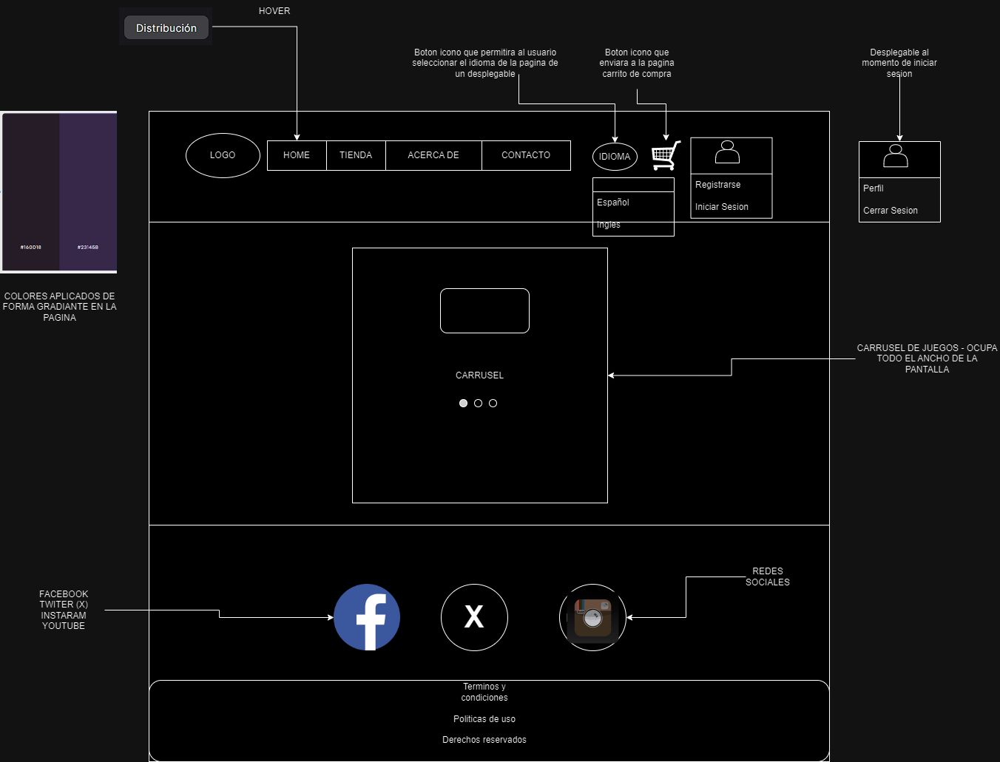
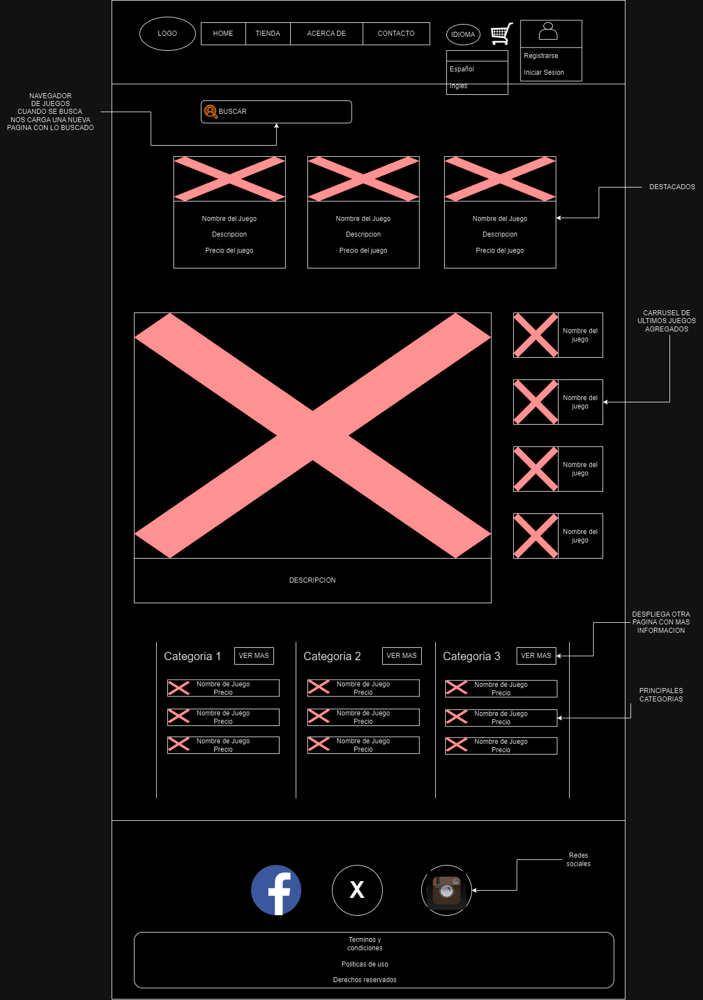
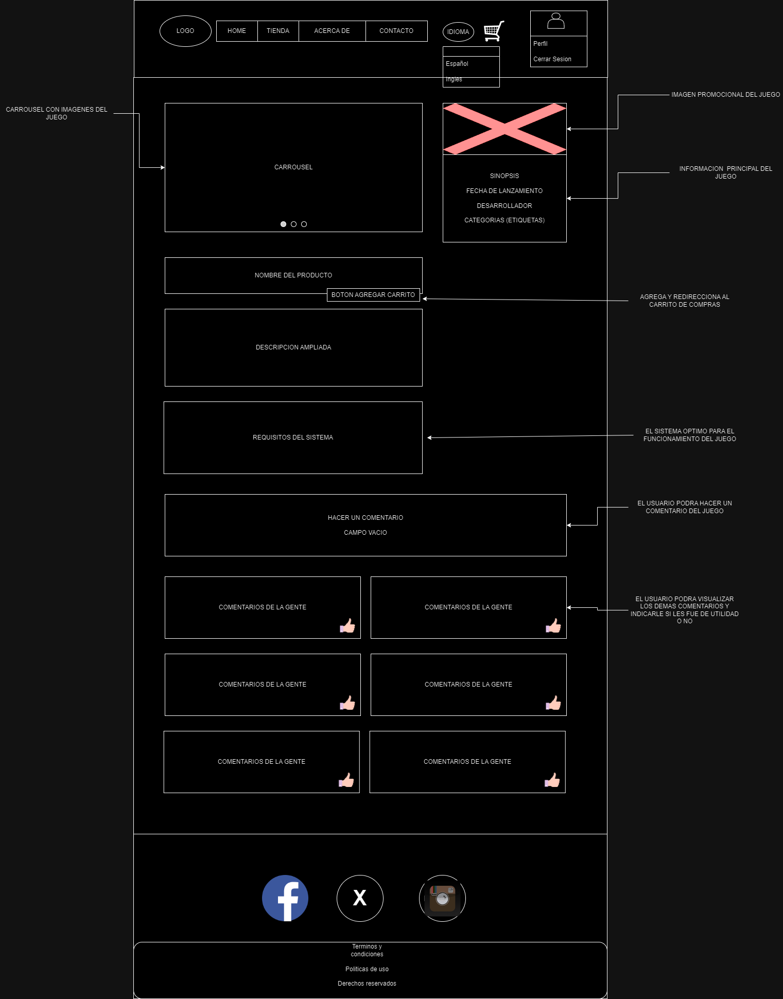
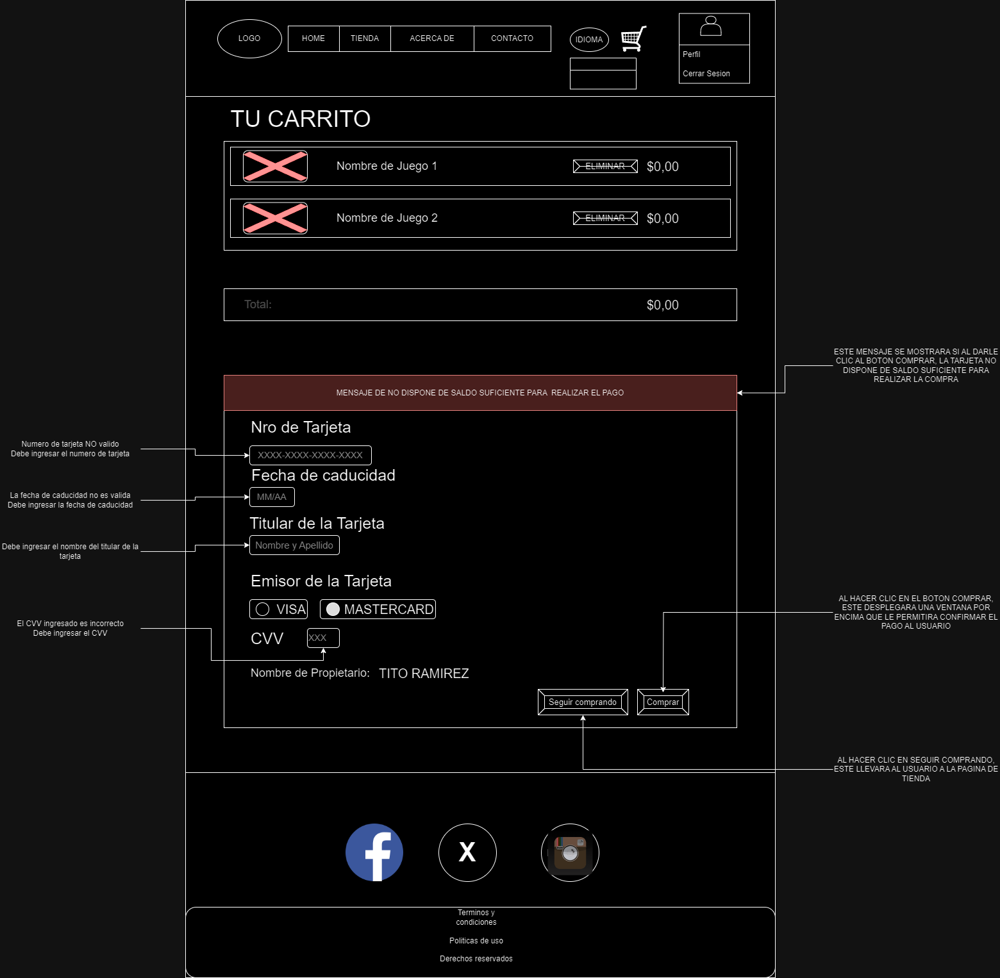
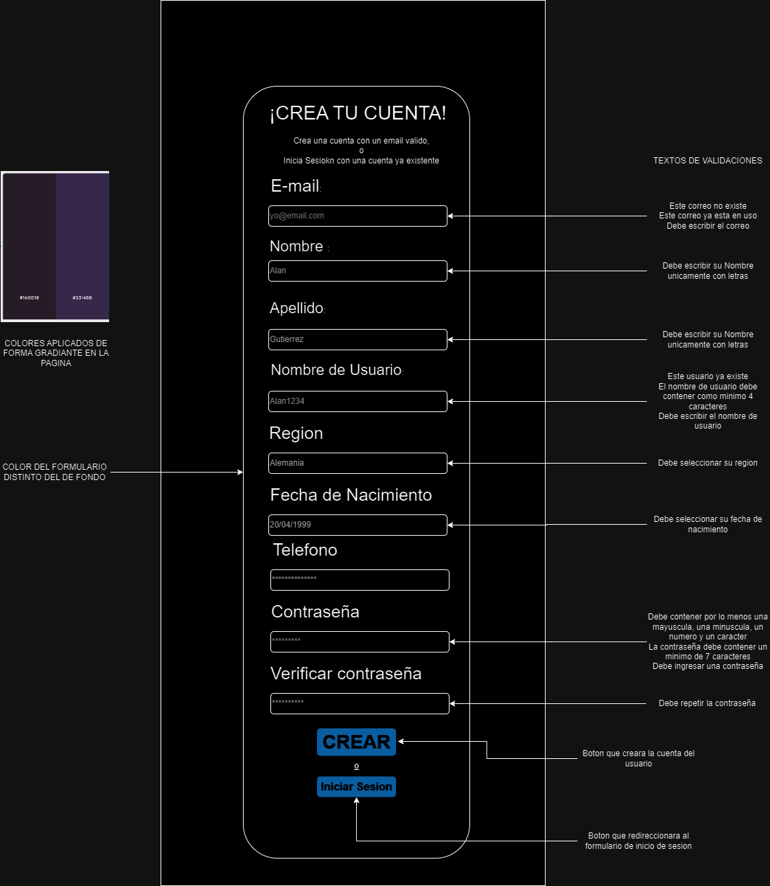
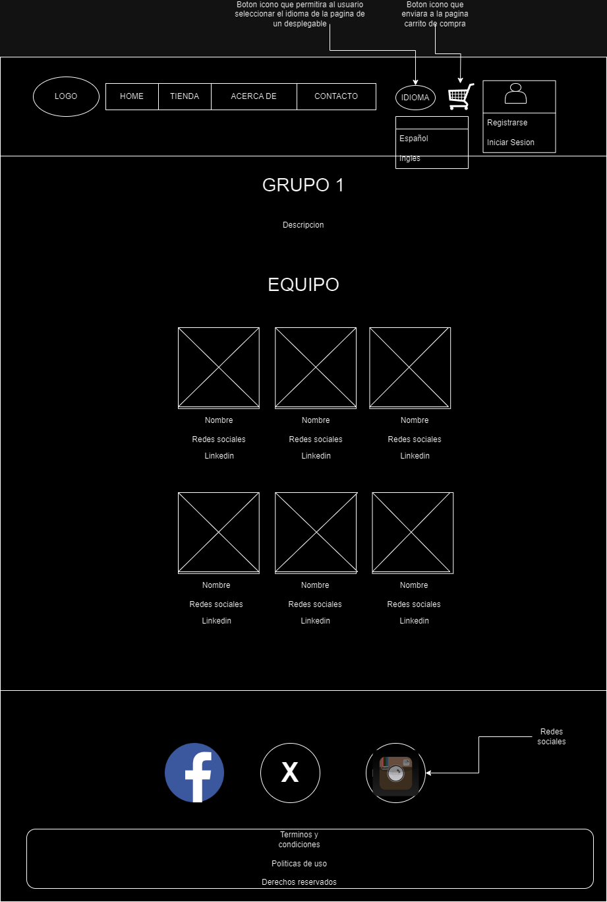
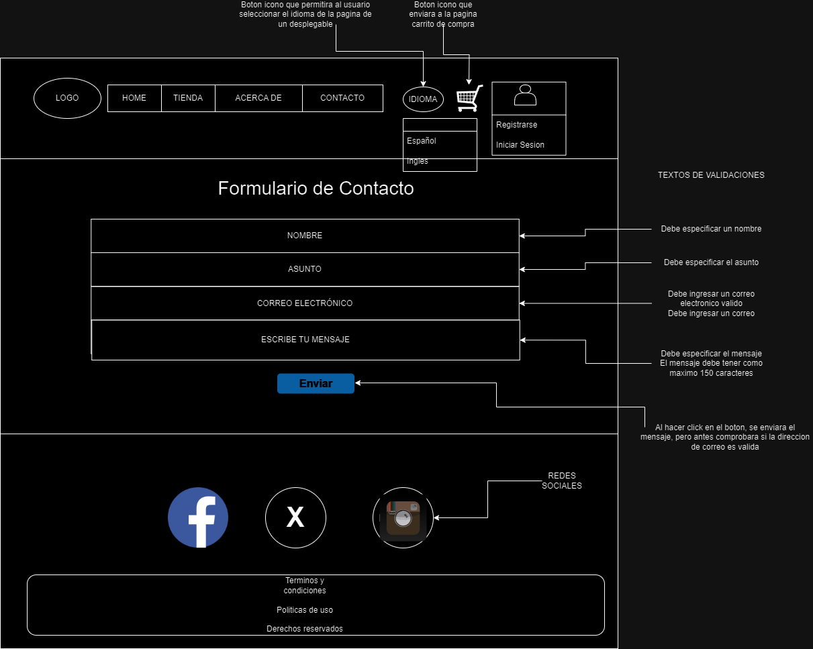

# Proyecto Integrador

Este es el repositorio de "Cazon, Nataniel Patricio jesus" para llevar a cabo el desarrollo de los sprints del proyecto integrador final del curso de dasarrollador **Full Stack** de Digital House - Playground.

# Pagina de videojuegos🎮

Link del tablero de tareas (Trello): [Link de Trello](https://trello.com/invite/b/VjCVO501/ATTI5f25d65a5b12d752ff0d989e19f8ad1cFEC7C06D/sprints)

## Tematica de la Pagina

La pagina estara dedicada a ofrecer un amplio catalogo de seleccion de videojuegos. Desde titulos clasicos hasta los lanzamientos mas recientes

## Audiencia Objetivo

- Jugadores entusiastas de toda las edades que buscan las ultimas novedades y lanzamientos.
- Jugadores competitivos interesados en juegos multijugador en linea y esports.
- Personas interesadas en juegos indie y títulos independientes con propuestas innovadoras.

## Equipo

- **Cazon, Nataniel Patricio Jesus:** Hola, soy Nataniel, tengo 28 años y soy estudiante de ultimo año de las carreras Analista Programador Universitario (APU) y Tecnicatura Universitaria en Diseño Integral de Videojuegos (TUDIVJ). Me apacionan el deporte, los videojuegos y la buena musica. Espero sea una buena experiencia el poder trabajar en el desarrollo de esta pagina.

## Referencias

1) Epic Games
2) Steam
3) Origin
4) Xbox
5) G2A

## Estetica

Colores: [Paleta de Colores](https://paletadecolores.com.ar/paleta/282e5e/1e234f/141740/0a0c31/000022/)

Tipografia: [Google Fonts - Rubik](https://fonts.google.com/specimen/Rubik)

## Wireframes

### Home

### Tienda

### Detalles de Producto

### Carrito de Compra

### Login

### Registro

### Acerca de

### Contacto

